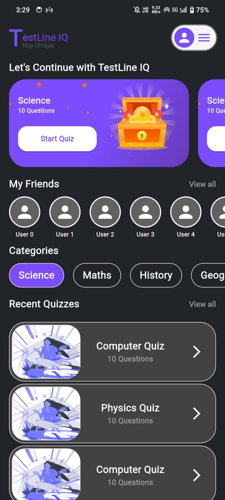
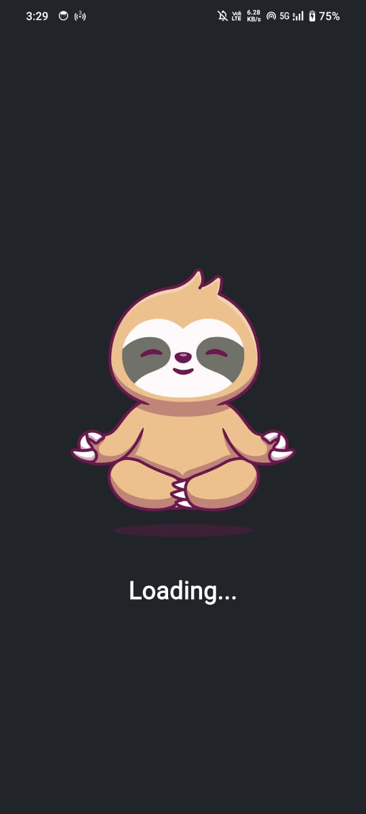
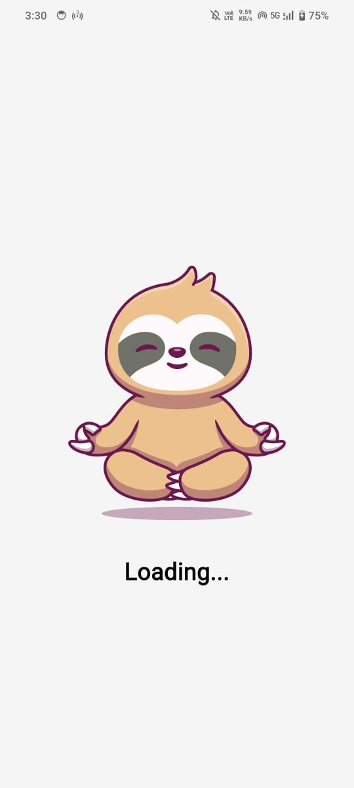
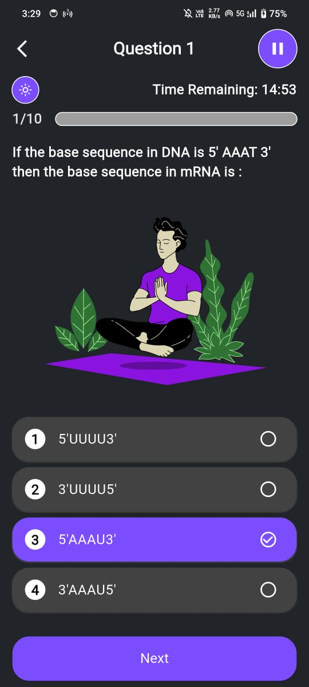
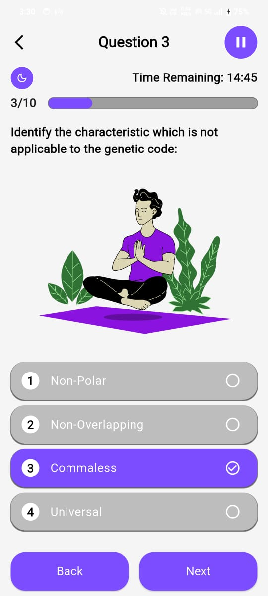
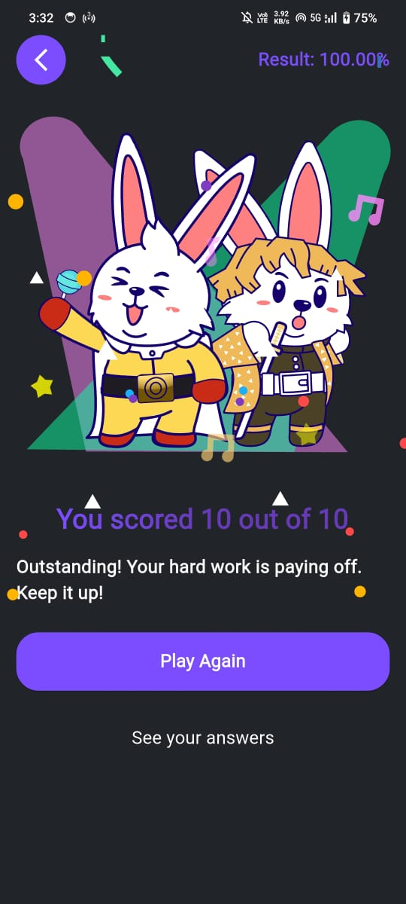
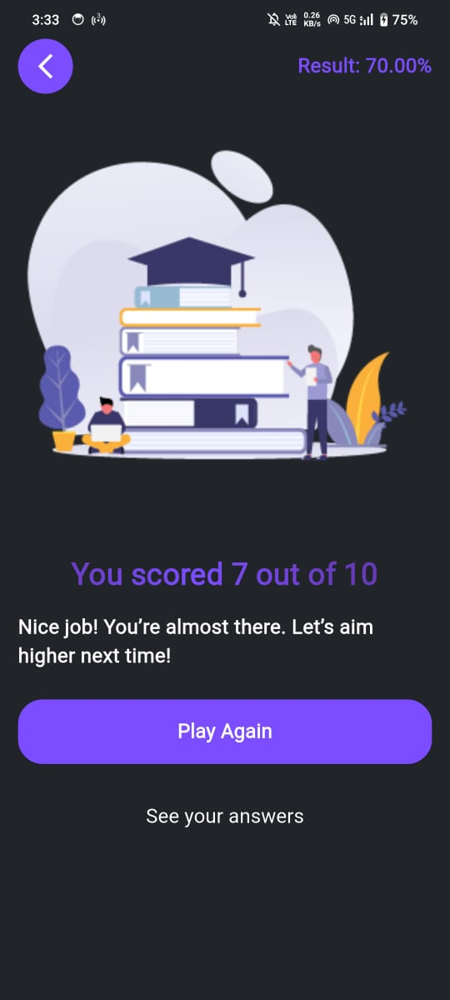
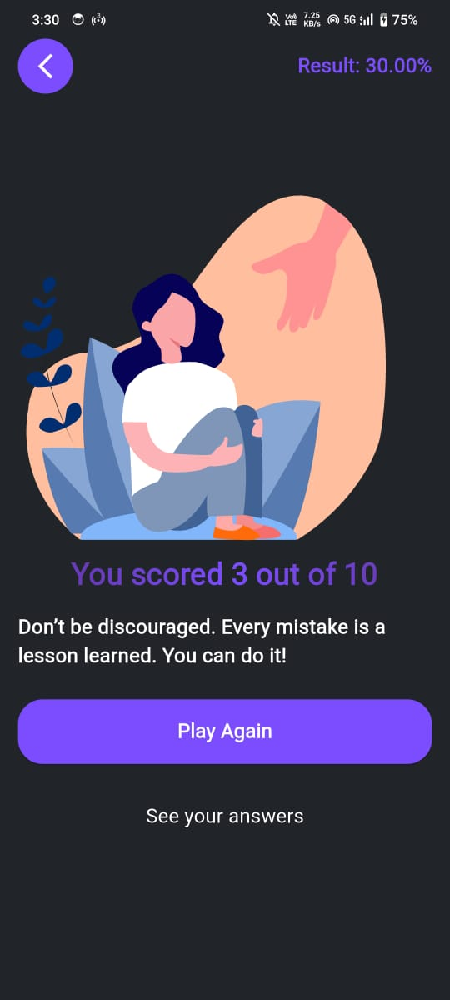

# TestLine IQ: Quiz Application
#### This is a Flutter-based quiz application that provides multiple-choice questions and a motivational system to encourage users based on their quiz performance. The app calculates scores dynamically and offers motivational messages according to the user's results.

---
## Features
- **Multiple-Choice Questions:** Users can answer multiple-choice questions and receive immediate feedback.
- **Score Calculation:** The app calculates the user's score based on their correct answers.
- **Motivational System:** Based on the percentage score, motivational quotes are displayed to the user:
    - **Above 80%:** A congratulatory message encourages users to maintain their performance.
    - **Between 40% and 80%:** A motivational message prompts users to aim for a higher score.
    - **Below 40%:** An encouraging message reassures users to keep trying and improve their results.
- **Lottie Animations:** Different animations based on the performance:
    - Winning animation for scores above 80%.
    - Normal animation for scores between 40% and 80%.
    - Failure animation for scores below 40%.
- **Pop-up Effects:** Celebration effects (e.g., confetti) are displayed for high scores (above 80%).
- **Play Again Option:** Users can take the quiz again with a "Play Again" button.
- **Shimmer Effect:** Animated score display with a shimmer effect to enhance the user experience.
---

## Demo Video

<video width="600" controls>
  <source src="screenshots/demo.mp4" type="video/mp4">
  Your browser does not support the video tag.
</video>


## Screenshots

#### Start Screen Dark Mode

#### Start Screen Light Mode


#### Loading Screen Dark Mode


#### Loading Screen Light Mode


#### Quiz Screen Dark Mode

#### Quiz Screen Light Mode



#### Won Screen

#### 40-80 Screen

#### Fail Screen



---
## Installation
- **Clone the Repository:**

```bash
  git clone https://github.com/rahul-cse-25/quiz-app.git
  cd quiz-app
```

- **Install Flutter Dependencies:** Make sure Flutter is installed on your machine. Then, install the required dependencies by running:

```bash
  flutter pub get
```

- **Run the App:**

```bash
  flutter run
```
---
## How It Works
- **Quiz Logic:**

    - The app presents questions fetched from the Quiz model.
    - Users select answers, and upon submitting, the app calculates their score.

- **Score Calculation:**

    - The user's score is calculated based on correct answers.
    - Percentage score = (Correct Answers / Total Questions) * 100.

- **Motivational Quotes:**

    - The following motivational quotes are displayed based on the percentage:
        - **Above 80%:**
            - "Outstanding! Your hard work is paying off. Keep it up!"
        - **40%-80%:**
            - "Nice job! You’re almost there. Let’s aim higher next time!"
        - **Below 40%:**
            - "Don’t be discouraged. Every mistake is a lesson learned. You can do it!"
        - **Animations:**

            - Depending on the user's performance, the app displays different Lottie animations:
              - Above 80%: Success animation.
              - 40%-80%: Neutral animation.
              - Below 40%: Failure animation.
        - **UI Features:**
            - Shimmer effect on the score text to add some visual appeal.
            - Confetti animation for high scores (above 80%).
---
## 📂 File Structure
```bash

├── lib
│   ├── models
│   │     ├── answer.dart                 # Answer model
│   │     └── option.dart                 # Option model
│   │     └── questions.dart              # Question model
│   │     └── quiz.dart                   # Quiz model containing questions, options and reading materials
│   │     └── reading_material.dart       # Reading material model
│   ├── utils
│   │     └── customize_style.dart        # Contains styling utilities for the app
│   │     └── debug_purpose.dart          # Colorful console logs for debugging
│   │     └── sizes.dart                  # size calculation for responsive UI
│   ├── extensions
│   │     └── theme.dart                  # Custom theme extension for UI adjustments
│   └── screens
│   |     └── result.dart                 # Displays quiz results with motivational quotes and animations
│   |     └── start_screen.dart           # Displays the quiz start screen
│   |     └── loading.dart                # Displays a loading screen
│   |     └── quiz_screen.dart            # Displays the quiz questions and answers
│   └── provider
│   |     └── home.dart                   # Manages the state of the start_screen
│   |     └── theme.dart                  # Manages the state of the theme
│   └── services
│         └── api_service.dart            # Handles API requests and responses
└── assets
      └── json
      |     ├── won.json                  # Lottie animation for winning
      |     ├── normal.json               # Lottie animation for neutral performance
      |     └── fail.json                 # Lottie animation for failure
      |     └── calm_boy.json             # Lottie animation for quiz_screen
      |     └── panda.json                # Lottie animation for loading
      |     └── calm_girl.json            # Lottie animation for start_screen
      |     └── box.json                  # Lottie animation for card container at start_screen 
      |     └── shine.json                # Lottie animation for card container at start_screen for bg
      |     └── party.json                # Lottie animation for celebration effect
      └── music
            └── birds.mp3                 # Background music for the app while playing the quiz
```

## Customization
You can modify the app to include additional features or customize the motivational quotes. Here are some ideas:

- Add more animations or customize the existing ones.
- Introduce different difficulty levels for the quiz.
- Integrate a leaderboard or a reward system based on performance.

## Dependencies
- Flutter: Ensure you have Flutter SDK installed.
- Shimmer: For text animation effects.
- Lottie: For displaying animations.
- Provider: For state management.
- Shared Preferences: For local storage.
- Audio Players: For playing audio effects.
- HTTP: For making network requests.

To add these dependencies, include them in your **pubspec.yaml** file:

```bash

dependencies:
  flutter:
    sdk: flutter
  http: ^1.2.2
  provider: ^6.1.2
  shared_preferences: ^2.3.5
  shimmer: ^3.0.0
  lottie: ^3.3.1
  audioplayers: ^6.1.0
```
---

## 🤝 Contribution Guidelines
#### We welcome contributions to enhance TestLine IQ! Here’s how you can contribute:

- Fork this repository.
- Create a new branch for your feature (git checkout -b feature-name).
- Make your changes and commit them (git commit -m "Add feature-name").
- Push to the branch (git push origin feature-name).
- Submit a pull request.

## 🌐 Contact
### For questions, feedback, or collaborations, feel free to reach out:
- **Email**: `rahul.coder.25@gmail.com`
- **GitHub**: [rahul-cse-25](https://github.com/rahul-cse-25)


## 📈 Future Enhancements
- Add more interactive animations based on user input.
- Store and display past quiz results using local storage.
- Integrate a leaderboard or a reward system based on performance.
- Add a settings screen for customization.
- Integrate a social login feature for user authentication.

# 📝 License
### This project is licensed under the [MIT License](LICENSE) - see the LICENSE file for details.

___

# Thank you for using TestLine IQ! Together, we ensure secure and fair quiz practices. 🎓💻